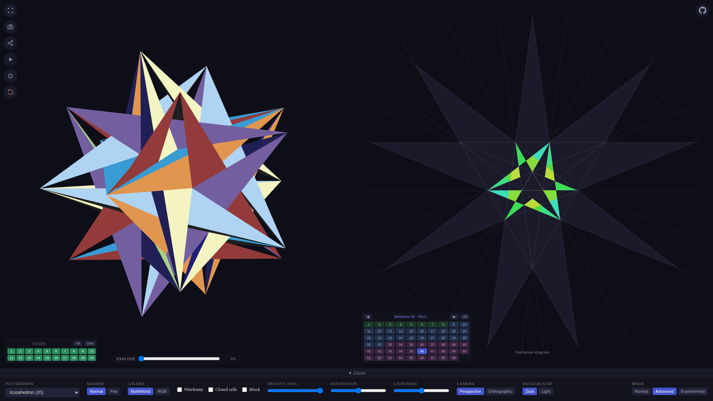
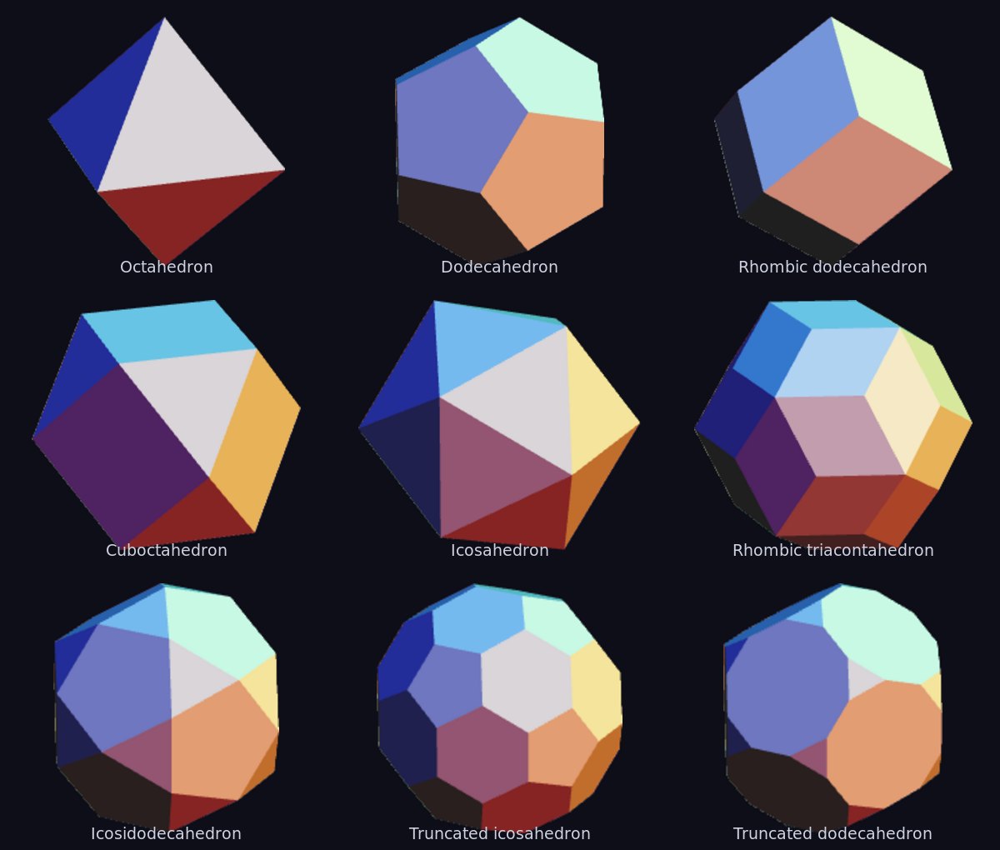
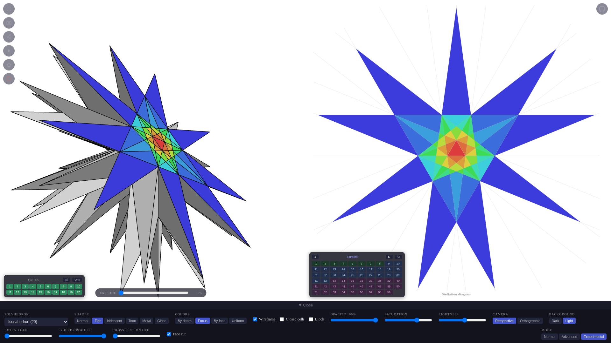
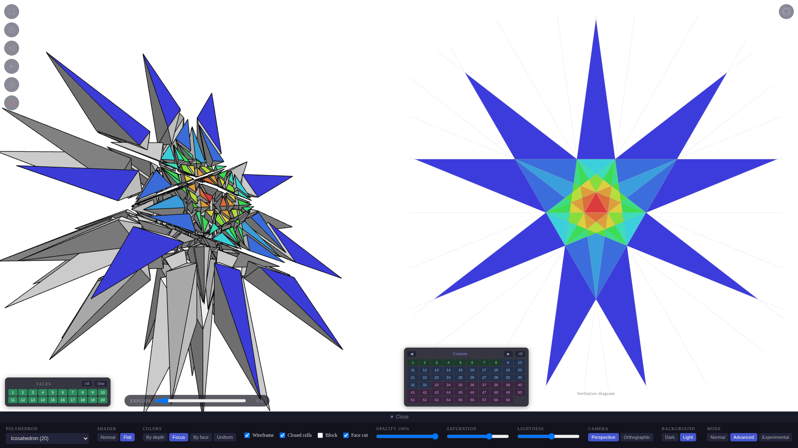
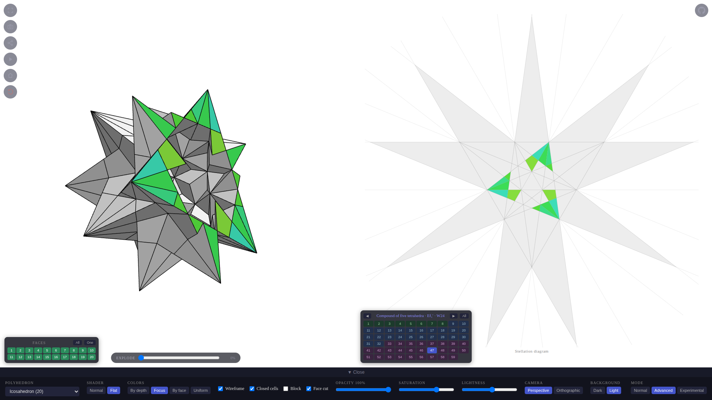
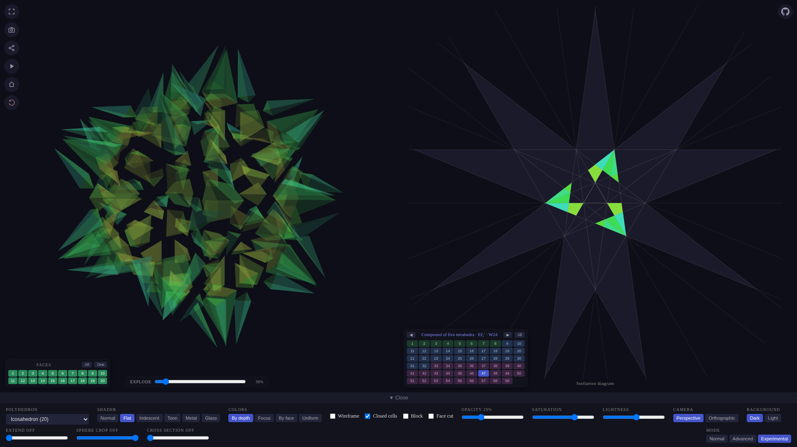
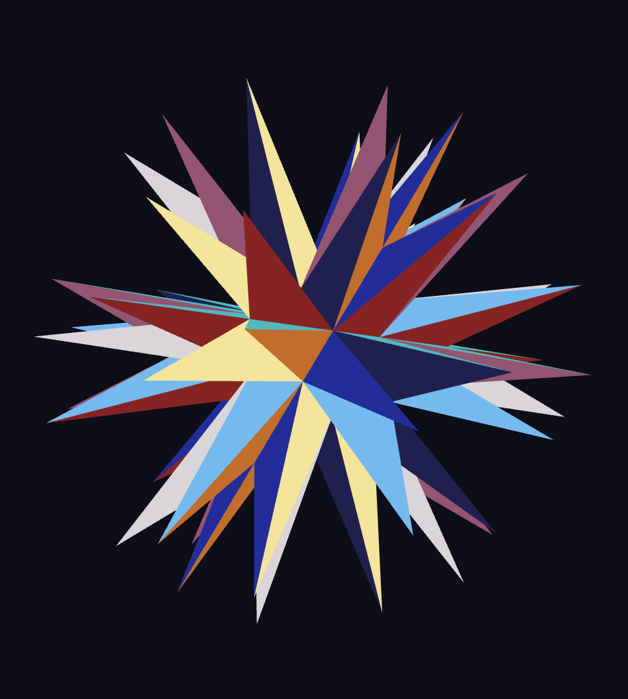
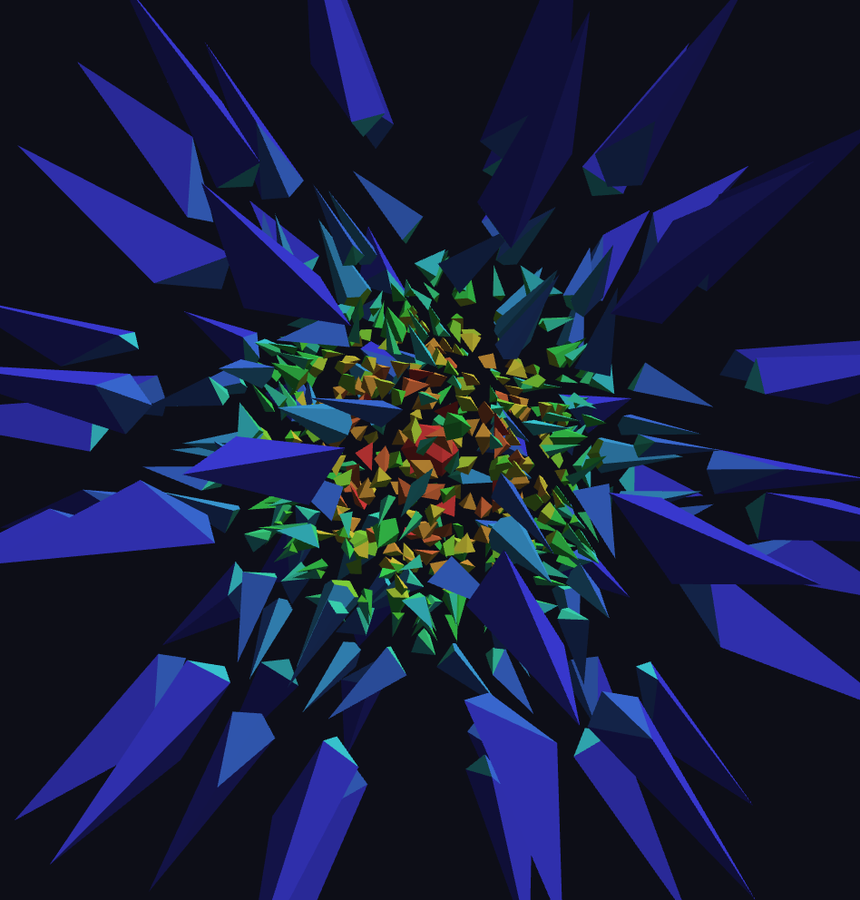
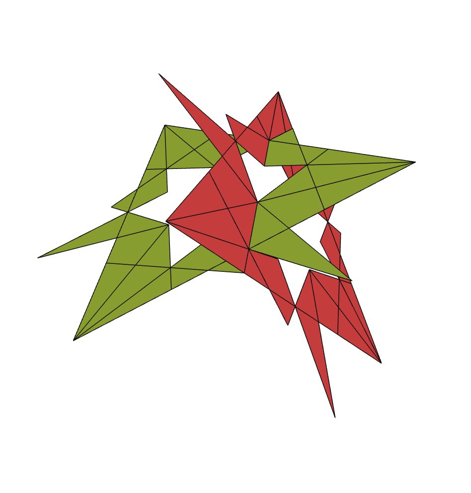
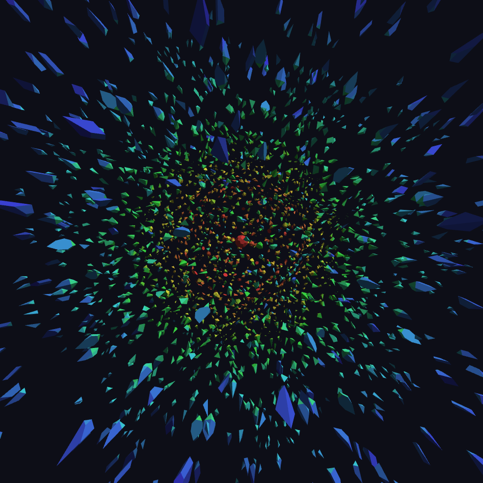

# Stellated Polyhedra Explorer



**Interactive 3D viewer of stellated polyhedra — the 59 stellations of the icosahedron and eight more solids, in your browser.**

🔗 **Live demo: <https://monman53.github.io/stellated-polyhedra-explorer/>**

A polyhedron's face planes cut space into cells whose combinations form its stellations. The icosahedron famously yields exactly 59, enumerated by Coxeter, Du Val, Flather and Petrie in *The Fifty-Nine Icosahedra* (1938). This app computes and renders the stellations of nine solids in WebGL — the icosahedron, dodecahedron, octahedron, cuboctahedron, icosidodecahedron, rhombic dodecahedron, rhombic triacontahedron, truncated icosahedron and truncated dodecahedron — and lets you build your own by painting the stellation diagram directly.



## Gallery










## Features

- **All 59 stellations as presets**, following the cell notation of
  [the Wikipedia list](https://en.wikipedia.org/wiki/The_Fifty-Nine_Icosahedra#List_of_the_fifty-nine_icosahedra)
  (Du Val region numbers), including the great icosahedron, the compound of
  five tetrahedra, and all chiral (left/right) forms. Drag or slide across
  the preset buttons to animate through the whole series.
- **Editable stellation diagram** — the 2D diagram of the reference face
  plane sits side by side with the 3D model. Click or drag-paint cells to
  add/remove them from the solid; the chiral cell orbits (regions 5, 6, 9,
  10) can be selected as left or right halves independently.
- **Explode view** — facets separate along the 3D cells of the face-plane
  arrangement, revealing how each stellation is layered out of shells.
- **Shading options** — normal-vector coloring (MathWorld style) or flat
  shading with palettes: by cell depth, by face plane (classic 10-hue
  illustration look), or *Focus* (color a single face plane to see how the
  2D diagram maps onto the 3D solid).
- **Opacity slider and wireframe overlay** for X-ray views of the inner
  structure.
- **Mobile friendly** — the diagram becomes a one-tap overlay on small
  screens; touch controls for orbit, pinch zoom, diagram painting and
  preset sliding.
- **More polyhedra** — the same pipeline also stellates the dodecahedron
  (the three Kepler–Poinsot stellations), the octahedron (stella
  octangula), the icosidodecahedron, whose 32 face planes in two orbits
  (icosahedral + dodecahedral) yield 463 diagram cells in 76 symmetry
  types, with presets for the dual compound and the compound of the great
  icosahedron and great stellated dodecahedron, the rhombic
  triacontahedron (30 golden-rhombus faces, 193 cells in 54 types) with
  presets for the compound of five cubes and the rhombic hexecontahedron,
  and the truncated icosahedron and truncated dodecahedron (515 cells in
  85 types each), whose stellations regrow their parent solids and reach
  the Kepler–Poinsot star polyhedra — the truncated dodecahedron passes
  through all four. The octahedral-symmetry family is covered by the
  cuboctahedron (first stellation: the compound of cube and octahedron)
  and the rhombic dodecahedron (first stellation: Escher's solid).

Everything is computed at runtime from the polyhedron's geometry — cell
arrangement, symmetry orbits, chirality split and explode grouping — with no
3D library; rendering is plain WebGL 1.

## Development

```bash
npm install
npm run dev      # local dev server
npm run build    # production build → dist/
```

Built with Vue 3, TypeScript and Vite. Google Analytics is only activated on
the production host (`monman53.github.io`), so development traffic is never
counted.

## References

- H.S.M. Coxeter, P. Du Val, H.T. Flather, J.F. Petrie, *The Fifty-Nine Icosahedra*, 1938
- [The Fifty-Nine Icosahedra — Wikipedia](https://en.wikipedia.org/wiki/The_Fifty-Nine_Icosahedra)
- [Icosahedral stellation diagram (Wikimedia Commons)](https://commons.wikimedia.org/wiki/File:Icosahedron_stellation_diagram_center.svg)

## License

[MIT](LICENSE) © monman53
